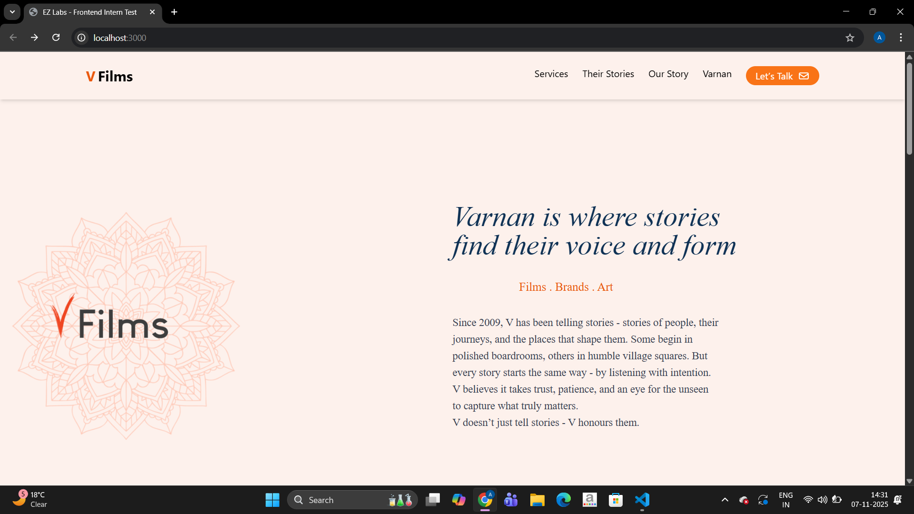
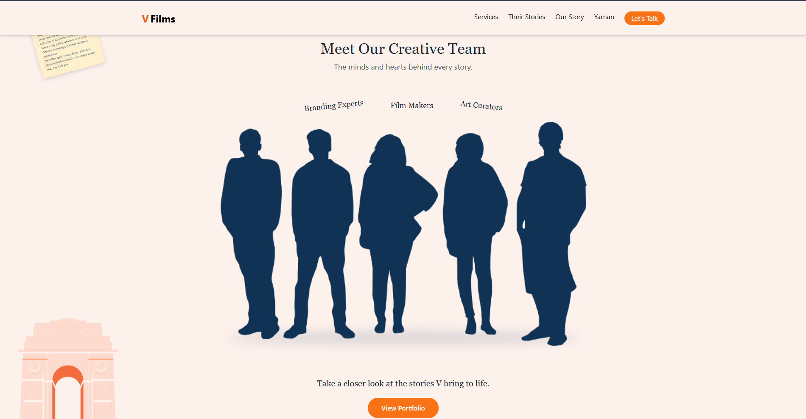
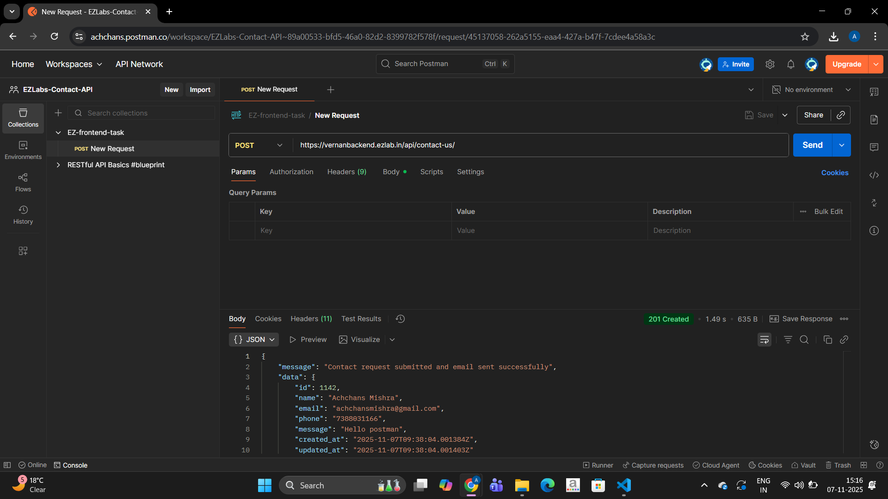

#  EZLabs Contact Page (React + Tailwind)

A **Single Page Application (SPA)** built using **React**, **Tailwind CSS**, **React Router**, and **Lucide React Icons**.  

##  Prerequisites

- **Node.js** v18 or above  
- **npm** v8 or above  

---

##  Getting Started

### 1️ Clone the Repository
git clone https://github.com/AchchansMishra/EZ-frontend-test.git
### 2 Navigate into the project
cd EZ-Intern_test

###3 Install dependencies
npm install

###4 start the project
npm start

Notes

Node.js v18 or newer recommended

If API URL or environment keys are required, create .env file

Postman collection provided for API verification

All styles are handled via Tailwind CSS classes

